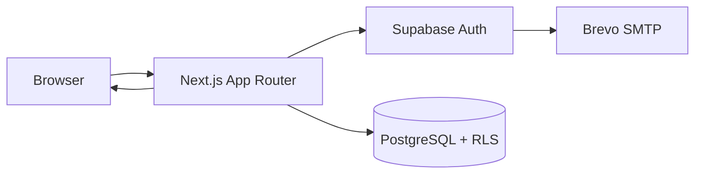

# Akadex

Akadex is a cozy academic companion for students who want one place to plan coursework, track grades, manage tasks, and log focus sessions. It is built with the Next.js App Router, TypeScript, Supabase Auth, Supabase/PostgreSQL, and Vercel.

Production: https://akadex.vercel.app

Status: active release-candidate development. The repository contains the working app, database schema, security audit notes, tests, and CI workflow, but some production controls still require platform verification outside the repo.

## Features

Repository evidence shows these features are implemented:

- Email/password authentication with signup, login, logout, email verification, password recovery, and password update.
- Protected dashboard routes that require a valid Supabase session.
- Semester management with year level, term, and school-year fields.
- Subject management inside semesters, including units and grade tracking.
- GWA-style weighted grade calculations using the configured grading scale.
- Task planner with create, edit, delete, completion status, priority, due dates, tags, subject links, search, and filters.
- Recurring tasks through `task_series`, materialized into task occurrences on a bounded planner horizon.
- Pomodoro timer with focus/break preferences and saved session history.
- Analytics for academic performance, task completion, and focus time.
- Settings/profile page for display name, theme selection, account overview, and sign out.
- Responsive landing and app layouts with light/dark theme support.

## Technology Stack

| Technology                                 | Role in Akadex                                                                                                                                             |
| ------------------------------------------ | ---------------------------------------------------------------------------------------------------------------------------------------------------------- |
| Next.js 16 App Router                      | Routing, layouts, Server Components, route handlers, server actions, metadata, and production build.                                                       |
| React 19                                   | Interactive UI, Client Components, forms, charts, dialogs, timer, and theme controls.                                                                      |
| TypeScript                                 | Static typing across app routes, components, utilities, tests, and configuration.                                                                          |
| Supabase Auth                              | Email/password accounts, verification links, recovery links, sessions, and user identity.                                                                  |
| Supabase/PostgreSQL                        | Application data storage for profiles, semesters, subjects, tasks, recurring task series, and Pomodoro sessions.                                           |
| Row Level Security                         | Database-side tenant isolation using `auth.uid()` ownership policies.                                                                                      |
| Tailwind CSS 4 and shadcn-style primitives | App styling, theme tokens, UI primitives, and responsive layout.                                                                                           |
| Vitest                                     | Unit tests for dates, recurrence, analytics activity logic, password policy, password input behavior, safe errors, Pomodoro helpers, and security headers. |
| GitHub Actions                             | CI quality checks on `main` and `dev`, plus automatic `dev` to `main` PR creation after successful `dev` CI.                                               |
| Vercel                                     | Hosting and production deployment.                                                                                                                         |
| Brevo                                      | Email provider through Supabase custom SMTP; dashboard configuration is outside repository evidence.                                                       |

## Architecture Overview

At a high level:

```text
Browser -> Next.js -> Supabase Auth/PostgreSQL -> Next.js -> Browser
```



Server Components load protected data on the server. Client Components handle browser-only behavior such as forms, dialogs, theme switching, charts, and the Pomodoro timer. Server actions mutate data after deriving the user from the authenticated Supabase session. The `/auth/callback` route handler exchanges email verification or recovery codes for a session, then redirects to the appropriate app page. PostgreSQL RLS remains the database backstop so user-owned rows are scoped to the authenticated user.

## Local Setup

Prerequisites:

- Node.js 20+
- npm
- A Supabase project

Install and run:

```bash
git clone <repository-url>
cd acadex
npm install
cp .env.example .env.local
npm run dev
```

Open http://localhost:3000.

Configure `.env.local` with placeholders from `.env.example`:

| Variable                               |                           Required | Browser-visible | Purpose                                                                                                                                                      |
| -------------------------------------- | ---------------------------------: | --------------: | ------------------------------------------------------------------------------------------------------------------------------------------------------------ |
| `NEXT_PUBLIC_SUPABASE_URL`             |                                Yes |             Yes | Supabase project URL used by browser and server Supabase clients.                                                                                            |
| `NEXT_PUBLIC_SUPABASE_PUBLISHABLE_KEY` |                                Yes |             Yes | Supabase publishable/anon key used with RLS-protected client access.                                                                                         |
| `NEXT_PUBLIC_APP_URL`                  | Yes for production, useful locally |             Yes | Canonical app origin for metadata and auth email callback URLs. Local default is `http://localhost:3000`; production should use `https://akadex.vercel.app`. |

Do not put private secrets in `NEXT_PUBLIC_*` variables. In particular, the Supabase service-role key must never be exposed to the browser or committed to the repository.

## Database Setup

The repository currently provides a single SQL schema file at [supabase/schema.sql](supabase/schema.sql). It is not yet organized as versioned Supabase migrations.

For a new Supabase project, review the schema, then apply it in the Supabase SQL editor or through an approved Supabase workflow. The schema creates app tables, indexes, triggers, and RLS policies. Keep production schema changes deliberate and backed up.

## Scripts

| Script       | Command                        | Purpose                                        |
| ------------ | ------------------------------ | ---------------------------------------------- |
| `dev`        | `next dev`                     | Start the local development server.            |
| `build`      | `next build`                   | Create a production build.                     |
| `start`      | `next start`                   | Serve the built production app locally.        |
| `lint`       | `eslint`                       | Run ESLint.                                    |
| `typecheck`  | `next typegen && tsc --noEmit` | Generate Next types and run TypeScript checks. |
| `test`       | `vitest run`                   | Run the test suite once.                       |
| `test:watch` | `vitest`                       | Run Vitest in watch mode.                      |

## CI and Branch Workflow

Development happens on `dev`. GitHub Actions runs lint, typecheck, tests, and build on pushes and pull requests targeting `main` or `dev`.

When a push to `dev` passes the quality job, the workflow can open a `dev` to `main` pull request using the repository `GITHUB_TOKEN`. It checks for an existing open promotion PR first, so it does not create duplicates. The workflow does not merge or approve the PR; `main` remains the production branch and still needs review/merge according to repository settings.

A passing CI run is a useful quality gate, not proof that the app has no bugs or vulnerabilities. Platform configuration, Supabase settings, Vercel deployment behavior, and live security checks still need manual verification.

## Security Overview

Implemented repository controls include:

- Supabase session validation for protected routes and mutations.
- Server-derived user IDs instead of trusting client-submitted ownership fields.
- RLS policies on user-owned tables.
- Scoped update/delete queries that include the authenticated user.
- Generic public errors for provider/database failures.
- Shared eight-character minimum password policy in app code.
- Centralized auth callback URL generation using `NEXT_PUBLIC_APP_URL`.
- Production security headers and `private, no-store` cache headers for authenticated routes.
- Public Supabase publishable configuration only; no service-role key usage in app code.

Some controls require owner/platform verification, including Supabase Auth URL settings, Supabase password policy, email rate limits, backups, monitoring, Brevo SMTP/template configuration, branch protection, and deployed response headers. See [SECURITY_AUDIT_REPORT.md](SECURITY_AUDIT_REPORT.md) for the current audit state.

## Testing

The current Vitest suite covers:

- Date helpers and recurrence date generation.
- Pomodoro helper logic.
- Analytics activity parsing and aggregation.
- Password minimum and confirmation validation.
- Password visibility input behavior.
- Safe server error mapping.
- Security header policy construction.

Use:

```bash
npm run typecheck
npm run lint
npm test
npm run build
```

## Roadmap

Evidence-based next steps:

- Convert `supabase/schema.sql` into versioned migrations.
- Add automated RLS and two-account isolation tests.
- Add account data export and self-service deletion.
- Complete legal, operational, backup, monitoring, dependency-audit, and security-contact work.
- Continue refining the Akadex learning experience, branding, and student workflows.

## Documentation

- [docs/Architecture.md](docs/Architecture.md), [docs/Database.md](docs/Database.md), [docs/PRD.md](docs/PRD.md), and [docs/SprintPlan.md](docs/SprintPlan.md) are older project documents and may lag behind implementation details.
- [SECURITY_AUDIT_REPORT.md](SECURITY_AUDIT_REPORT.md) tracks the current security review state.

## Contribution and License

No license file is currently present in the repository. Do not assume the project is open-source licensed. The project is currently maintained by its owner.
